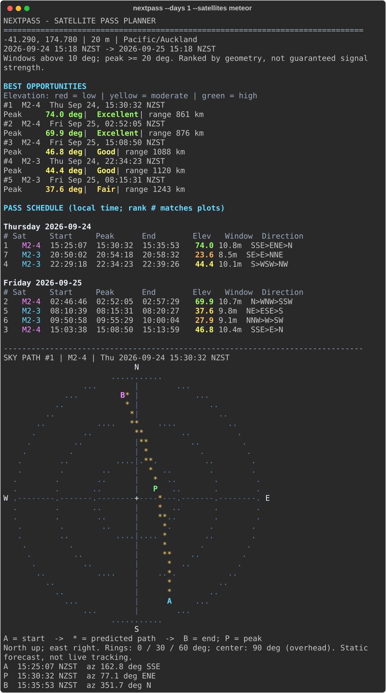

<div align="center">

```
 ███╗   ██╗███████╗██╗  ██╗████████╗██████╗  █████╗ ███████╗███████╗
 ████╗  ██║██╔════╝╚██╗██╔╝╚══██╔══╝██╔══██╗██╔══██╗██╔════╝██╔════╝
 ██╔██╗ ██║█████╗   ╚███╔╝    ██║   ██████╔╝███████║███████╗███████╗
 ██║╚██╗██║██╔══╝   ██╔██╗    ██║   ██╔═══╝ ██╔══██║╚════██║╚════██║
 ██║ ╚████║███████╗██╔╝ ██╗   ██║   ██║     ██║  ██║███████║███████║
 ╚═╝  ╚═══╝╚══════╝╚═╝  ╚═╝   ╚═╝   ╚═╝     ╚═╝  ╚═╝╚══════╝╚══════╝
```

### Know when to point the antenna up.

Quick, terminal-based planning for satellite reception, with built-in support for
Meteor-M2-3 and M2-4; ISS and Tiangong (CSS); AO-73, RS-44, SO-50, AO-123, AO-91
and FO-29; Metop-B and C; Fengyun-3A and 3C; GOES-18 and 19; and Elektro-L 3.
You can also select satellites by NORAD ID or add a custom catalog.

<p>


</p>
<p>
<a href="https://github.com/gdamdam/nextpass/actions/workflows/tests.yml"></a>
<a href="LICENSE"></a>


</p>

</div>

---

## ⚡ Quick start

### 1. Get the project

```sh
git clone https://github.com/gdamdam/nextpass.git
cd nextpass
python3 -m venv .venv
. .venv/bin/activate
python -m pip install -e .
```

On Windows PowerShell, use `py -3 -m venv .venv`, then
`.venv\Scripts\python.exe -m pip install -e .` and
`.venv\Scripts\Activate.ps1`. Both platforms expose the same `nextpass` command.

### 2. Set your private location

Run this once with your coordinates and IANA timezone. NextPass creates a
private file outside the repository with owner-only permissions:

```sh
nextpass --save-location --lat LAT --lon LON --altitude METRES --timezone AREA/CITY
```

Alternatively, create `~/.config/radio/location.json` yourself:

```json
{"lat": 0.0, "lon": 0.0, "altitude": 0, "timezone": "UTC"}
```

Enter your latitude and longitude in degrees, altitude
in metres, and IANA timezone. Optionally add a `"horizon"` key (a list of
`{"az", "el"}` points, e.g. `"horizon": [{"az": 0, "el": 5}, {"az": 135, "el": 22}]`)
surveyed with `--survey-horizon` to model local obstacles. Restrict access to a manually created file:

```sh
chmod 600 ~/.config/radio/location.json
```

### 3. Predict passes

```sh
nextpass --days 7
```

The first prediction downloads orbital data and prints your schedule. No personal
location is built in.

---

## 🖥 Example output

A one-day Meteor forecast for Wellington, New Zealand,
trimmed after the first sky plot:

```sh
nextpass --lat -41.29 --lon 174.78 --altitude 20 --timezone Pacific/Auckland --days 1 --satellites meteor --plots 1
```

<p align="center">

</p>

---

## 🛰 Choose satellites

The built-in list lives in [`catalog.json`](catalog.json), including GOES-18
and GOES-19 for fixed-dish HRIT/EMWIN planning. See current labels, groups,
NORAD IDs, and verification dates with:

```sh
nextpass --list-satellites
```

```sh
nextpass --satellites meteor --days 3
nextpass --satellites iss,m2-4,so-50 --days 3
```

Omit `--satellites` to include all built-ins. You can also use a NORAD ID
directly or a [custom catalog](docs/guide.md#extend-the-satellite-catalog).

---

## 🎛 Common tasks

Add these options to `nextpass --days 7`:

| Task | Options |
|---|---|
| Find higher passes during convenient hours | `--min-elevation 40 --hours 08:00-22:00` |
| Prefer longer reception windows | `--rank-by duration` |
| Prefer daylight ground tracks for weather imagery | `--rank-by imagery` |
| Watch live pointing angles | `--live --satellites meteor` |
| Stream rotor-ready azimuth/elevation records | `--live --live-format jsonl --satellites M2-4` |
| Plan Doppler correction at 137.9 MHz | `--frequency 137.9 --track-csv track.csv` |
| Show a ground position and horizon footprint | `--ground-track` |
| Export a calendar with a 30-minute reminder | `--ics passes.ics --reminder-minutes 30` |
| Run local desktop reminders | `--watch --reminder-minutes 30` |
| Export results for other tools | `--json passes.json --csv passes.csv` |
| Save a shareable report for your phone | `--report passes.html` |
| Show possible visual passes | `--satellites stations --visible-only` |
| Include radio frequency information | `--radio` |
| See recent volunteer reception reports | `--recent-reports` |
| Use previously cached data without downloads | `--offline` |
| Show the schedule without sky plots | `--no-plot` |
| Include low passes normally hidden by the 20° minimum | `--all-passes` |
| Model obstacles around your antenna | `--survey-horizon` once, then nothing: every run uses the mask |

`--frequency 137.9` prints estimated downlink tuning at AOS, peak, and LOS;
`--track-csv` adds a sampled frequency and azimuth/elevation schedule. `--live`
updates pointing angles until Ctrl-C, and `--live-format jsonl` streams them
for other software. Nextpass does not command a rotor or retune an SDR.
`--rank-by imagery` samples daylight beneath the satellite and downloads a
planetary ephemeris on first use.

### Reminders

Import an ICS file to get alarms from your calendar app. For desktop
notifications, `--watch` checks for passes and refreshes predictions every six
hours.

- **macOS:** Run `nextpass --service install` to start a background
  service. Run `nextpass --service uninstall` to remove it.
- **Linux:** Run `--watch` under a user service manager.

Service logs can contain your location.

### Radio reports

`--radio` shows published SatNOGS transmitter records. `--recent-reports` shows
past AMSAT volunteer reception reports. Neither confirms that a transmitter
will be active during your pass.

### Calendar updates

Regenerate an ICS file at the same path to retain event IDs when a predicted
peak shifts by 20 minutes or less.

The schedule flags overlapping passes on different satellites so a single SDR
operator can choose which one to receive.

Run `nextpass --help` for all options.

---

## 📖 Read the results

**Ranking:** Passes sort by peak elevation. Use `--rank-by duration` to favor
longer reception windows, or `--rank-by imagery` to favor daylight beneath the
satellite along the pass. All are geometry-based: none predicts signal
strength or whether a transmitter is active. Antennas, obstructions and
interference also affect reception. Local obstructions are modeled only when
a horizon mask has been surveyed (`--survey-horizon`).

**Default thresholds:** A reception window starts and ends at 10° elevation.
Only passes peaking at 20° or higher appear.

**Visual passes:** The filter samples sunlight and darkness across each pass.
It cannot account for clouds or brightness, and local obstructions are modeled
only when a horizon mask has been surveyed. The first online use
downloads a planetary ephemeris.

Orbital data is cached for six hours. Use `--refresh` when it is old and you
need current elements; avoid repeated refreshes within CelesTrak's two-hour
update cycle.

**Privacy:** Exports contain coordinates, and pass times can reveal your
location. Keep them and your location file outside Git; ignore rules alone do
not prevent accidental sharing.

---

## 📱 Shareable pass report

Save one HTML file with the schedule and sky charts, ready to send to a phone:

```sh
nextpass --days 3 --report passes.html --no-plot
```

The report has a card for each of the `--top` passes, with start, peak and end
times, azimuths, window length and a sky chart. A table lists every pass by
day. It adds Doppler offsets with `--frequency`, visual notes with
`--visibility`, radio data with `--radio`, and the shaded horizon mask when one
is configured. It needs no extra packages and works offline. It follows the
phone's light or dark mode. Use the browser's Share, Print or Save as PDF to
keep a PDF copy.

---

## 🗓 Daily sky-path pictures

Install image support into the active environment:

```sh
python -m pip install 'matplotlib>=3.7'
```

Save every above-horizon pass for one satellite on a local calendar day:

```sh
nextpass --satellites M2-4 --date 2026-09-23 --day-plot meteor-day.png --no-plot
nextpass --satellites M2-4 --day-plot meteor-today.pdf --no-plot
```

Omit `--date` to plot today in your configured timezone. Save as PNG, PDF or
SVG; PDF is handy for printing. Each pass gets a sky panel with direction
arrows, rise/set times, peak time and elevation, and orbital epoch. North is
up, east is right, the outer ring is the horizon, and the centre is overhead.

`--day-plot` uses one satellite and one full local day:

- It overrides `--days` and includes low passes by setting both elevation
  thresholds to 0°.
- It rejects `--hours` and `--visible-only`, which would hide some passes.
- A pass belongs to the day of its peak, even if its track crosses midnight.
- `--no-plot` hides terminal plots but still saves the image.

Ordinary predictions do not need Matplotlib.

Include low passes in the normal terminal schedule without making a picture:

```sh
nextpass --days 2 --satellites meteor --all-passes
```

`--all-passes` overrides both elevation thresholds to 0°; date, satellite and
explicit hour/visibility filters still apply. Omit it to keep the usual defaults.

---

## 📚 Learn more

- [Sky plots and output fields](docs/guide.md#reading-the-output)
- [Calendar exports and visual passes](docs/guide.md#calendar-events-and-reminders)
- [Radio metadata](docs/guide.md#optional-radio-metadata) · [Orbital data and caching](docs/guide.md#orbital-data-freshness)
- [Location configuration](docs/guide.md#private-location)
- [Pip installation](docs/guide.md#quickstart) · [Tests and validation](docs/guide.md#validation)

Use [iqscan](https://github.com/gdamdam/iqscan) to inspect the recording afterward.
